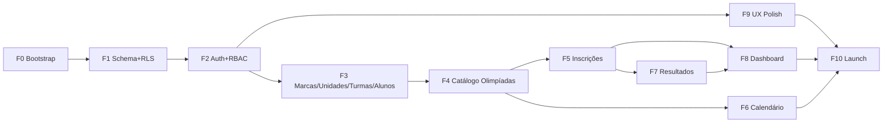

# Execution Plan — Olimpíadas Raiz Educação

**Refs:** [olimpiadas-prd.md](../specs/olimpiadas-prd.md), [olimpiadas-spec.md](../specs/olimpiadas-spec.md), [addendum v1.1](../specs/olimpiadas-spec-addendum-v1.1.md)
**Duração estimada:** 8-10 semanas (1 dev full-time) ou 4-5 semanas (2 devs paralelos)
**PRs previstos:** 11
**Modo recomendado:** `/ag-0-orquestrador` fatiando para `/ag-1-construir --force-single-pr` por fase

---

## Visão geral das fases

```
F0 ─► F1 ─► F2 ─┬─► F3 ─► F4 ─► F5 ─► F6 ─► F7
                ├─► F8
                └─► F9 ─► F10
```

F1, F8 e F9 podem rodar em **paralelo** (sem overlap de arquivos) após F0 estar mergeado.

---

## Fase 0 — Bootstrap (PR #1)

**Duração:** 1-2 dias
**Owner:** Tech Lead
**Depende de:** nada
**Gate:** projeto roda local + CI passa
**Rollback:** revert PR

### Entregáveis

- Scaffolding Next.js 15 App Router + TypeScript strict
- Tailwind + shadcn/ui setup
- Supabase project provisionado (dev + staging + prod)
- Resend account + domínio verificado
- Vercel project linkado, env vars configuradas
- Sentry SDK integrado
- ESLint + Prettier + Husky pre-commit
- CI básico: typecheck + lint + test
- README + CONTRIBUTING

### Skill

`/ag-6-iniciar` (scaffolding) + `vercel:bootstrap`

### Arquivos

- `package.json`, `tsconfig.json`, `next.config.ts`
- `app/layout.tsx`, `app/page.tsx` (landing minimal)
- `.env.example`, `.github/workflows/ci.yml`
- `README.md`, `CONTRIBUTING.md`

---

## Fase 1 — Schema + RLS (PR #2)

**Duração:** 3-4 dias
**Depende de:** F0
**Gate:** todas as migrations aplicam, suite de testes RLS passa 100%
**Rollback:** migration `_down.sql` por entidade

### Entregáveis

- Migrations completas (SPEC §3.2 + addendum v1.1)
- RLS policies para todas as tabelas
- Função helpers (`user_marca_ids`, `current_role`, `inscrever_com_lock`)
- Triggers (consentimento, audit)
- Seed mínimo (6 marcas + 1 admin_rede)
- Suite de testes RLS (matrix role × entidade × ação)
- TypeScript types codegen (`supabase gen types`)

### Skill

`/ag-1-construir --force-single-pr` modo refactor (sem PRD, com SPEC §3 já existente)

### Arquivos críticos

- `supabase/migrations/20260519_001_schema_inicial.sql`
- `supabase/migrations/20260519_002_rls_policies.sql`
- `supabase/migrations/20260519_003_functions_triggers.sql`
- `supabase/seed.sql`
- `tests/integration/rls/*.test.ts`
- `lib/types/database.ts`

---

## Fase 2 — Auth + Convite + RBAC (PR #3)

**Duração:** 4-5 dias
**Depende de:** F1
**Gate:** 4 perfis logam, convite por email funciona, RBAC matrix testada
**Rollback:** feature flag `AUTH_ENABLED=false`

### Entregáveis

- Páginas login, esqueci senha, reset senha, aceitar convite
- Middleware refresh session
- `lib/auth/rbac.ts` matrix + componente `<Can>`
- Server Action: criar convite, aceitar convite
- Email template: convite (React Email)
- Página /usuarios (admin_rede/coord_marca)
- Seletor de marca ativa (header) para coord_marca multi-marca

### Arquivos

- `app/(auth)/login/page.tsx`
- `app/(auth)/aceitar-convite/[token]/page.tsx`
- `lib/supabase/{server,client,middleware}.ts`
- `lib/auth/rbac.ts`
- `lib/email/templates/convite.tsx`
- `components/auth/Can.tsx`
- `components/layouts/HeaderMarcaSelector.tsx`

---

## Fase 3 — Módulo Marcas + Unidades + Turmas + Alunos (PR #4)

**Duração:** 5-6 dias
**Depende de:** F2
**Gate:** CRUD completo + RLS isola, consentimento LGPD bloqueia se ausente
**Rollback:** feature flag por módulo

### Entregáveis

- CRUD: marca (admin_rede), unidade, turma, aluno
- Form de aluno com upload de consentimento
- Listagem com filtros e paginação
- Validações zod
- Import de alunos via Excel (template + parser)

### Arquivos

- `app/(marca)/unidades/...`, `app/(unidade)/turmas/...`, `app/(unidade)/alunos/...`
- `lib/validations/{aluno,turma,unidade,marca}.ts`
- `components/alunos/AlunoForm.tsx`
- `app/api/alunos/lote/route.ts`

---

## Fase 4 — Módulo Catálogo de Olimpíadas (PR #5)

**Duração:** 4-5 dias
**Depende de:** F3
**Gate:** CRUD funciona, upload regulamento OK, multi-marca persiste, RLS testada
**Rollback:** flag

### Entregáveis

- CRUD olimpíadas (admin_rede + coord_marca)
- Multi-seleção de marcas
- Upload regulamento (Supabase Storage)
- Rich text editor (TipTap ou shadcn/editor) com sanitização
- Listagem com filtros (área, classificação, marca, ano)
- Página detalhe com fases

### Arquivos

- `app/(marca)/olimpiadas/{page,novo,[id]/page,[id]/editar}.tsx`
- `components/olimpiadas/{OlimpiadaForm,OlimpiadaList,FasesEditor}.tsx`
- `lib/validations/olimpiada.ts`
- `lib/storage/regulamentos.ts`

---

## Fase 5 — Módulo Inscrições (PR #6)

**Duração:** 5-7 dias
**Depende de:** F4
**Gate:** inscrição individual + lote funcionam, race condition testada, email Resend dispara
**Rollback:** flag

### Entregáveis

- Inscrição individual (form com seletor de aluno)
- Inscrição em lote (upload .xlsx)
- API de geração de planilha modelo
- API de upload com validação linha-a-linha
- Mudança de status com email
- Listagem de inscrições por olimpíada
- Histórico por aluno
- Função `inscrever_com_lock` (race condition)

### Arquivos

- `app/(unidade)/inscricoes/{page,nova,lote}.tsx`
- `app/api/inscricoes/lote/route.ts`
- `app/api/inscricoes/planilha-modelo/route.ts`
- `components/inscricoes/*`
- `lib/email/templates/{inscricao-confirmada,status-alterado}.tsx`
- `tests/e2e/inscricoes-lote.spec.ts`

---

## Fase 6 — Módulo Calendário (PR #7)

**Duração:** 4-5 dias
**Depende de:** F4 (precisa de olimpíadas cadastradas)
**Gate:** views funcionam, exports OK, alertas disparam
**Rollback:** flag

### Entregáveis

- Visão mensal (react-big-calendar ou custom)
- Visão anual e lista
- Filtros combinados
- Export .ics (`/api/calendario/export-ics`)
- Export PDF (`/api/calendario/export-pdf`)
- Cron job: alertas ≤15 dias (Supabase scheduled function ou Vercel Cron)

### Arquivos

- `app/(*)/calendario/page.tsx`
- `components/calendario/{MonthView,YearView,ListView,Filtros}.tsx`
- `app/api/calendario/export-{ics,pdf}/route.ts`
- `lib/exports/{ics,pdf-calendario}.tsx`
- `supabase/functions/cron-alertas-prazo/index.ts`

---

## Fase 7 — Módulo Resultados (PR #8)

**Duração:** 3-4 dias
**Depende de:** F5
**Gate:** lançamento por fase OK, upload comprovante OK, histórico OK
**Rollback:** flag

### Entregáveis

- Form de lançamento de resultado (por olimpíada+fase)
- Upload comprovante (Supabase Storage)
- Listagem de resultados por olimpíada
- Histórico por aluno (timeline)
- Validação: resultado apenas para inscrições não-canceladas

### Arquivos

- `app/(marca)/olimpiadas/[id]/resultados/page.tsx`
- `app/(unidade)/resultados/page.tsx`
- `components/resultados/{ResultadoForm,HistoricoAluno}.tsx`
- `lib/validations/resultado.ts`

---

## Fase 8 — Módulo Dashboard (PR #9)

**Duração:** 6-8 dias
**Depende de:** F5 + F7 (dados existem para agregar)
**Gate:** 4 visões renderizam, indicadores corretos, export PDF/Excel funciona, perf <3s
**Rollback:** flag

### Entregáveis

- 4 visões hierárquicas
- 8+ indicadores (PRD §3.6)
- Filtros (período, marca, unidade, área, tipo)
- Recharts: bar, line, pie
- Ranking marcas/unidades
- Export PDF (template @react-pdf)
- Export Excel (exceljs)
- View `v_dashboard_inscricoes`

### Arquivos

- `app/(admin-rede)/dashboard/page.tsx`
- `app/(marca)/dashboard/page.tsx`
- `app/(unidade)/dashboard/page.tsx`
- `components/dashboard/{IndicadoresKPI,RankingMarcas,EvolucaoChart,*}.tsx`
- `app/api/dashboard/export/route.ts`
- `lib/dashboard/queries.ts`

---

## Fase 9 — UX polish + Onboarding (PR #10)

**Duração:** 3-4 dias
**Depende de:** F2 (auth)
**Pode rodar em paralelo:** F4-F8
**Gate:** Lighthouse a11y ≥90, mobile responsivo, onboarding tour funciona
**Rollback:** flag

### Entregáveis

- Layout responsivo (tablet 768px+)
- Onboarding tour (tour.js ou shepherd.js) por perfil
- Dark mode toggle
- Empty states em todas as listas
- Loading states + skeletons
- Toasts (sonner)
- Refinos visuais alinhados ao design system Raiz

### Arquivos

- `components/onboarding/Tour.tsx`
- `components/ui/{EmptyState,Skeleton}.tsx`
- Refinos pontuais em todas as páginas

---

## Fase 10 — Documentação por perfil + Launch (PR #11)

**Duração:** 2-3 dias
**Depende de:** F9
**Gate:** docs publicadas, smoke test em prod OK, monitoring ativo
**Rollback:** -

### Entregáveis

- `docs/user-guide/admin-rede.md`
- `docs/user-guide/coord-marca.md`
- `docs/user-guide/coord-unidade.md`
- `docs/user-guide/professor.md`
- Vídeos curtos (Loom) por fluxo crítico (opcional)
- Página `/ajuda` na app
- Smoke test E2E completo em staging
- Deploy prod + monitoring (Sentry + Vercel Analytics)
- Plano de comunicação interna para launch

---

## Grafo de dependências



---

## Paralelização possível

Para acelerar (2 devs):

- **Dev A**: F0 → F1 → F2 → F3 → F4 → F5 → F7
- **Dev B** (após F0): F6 (em paralelo com F4-F5) + F8 (após F5) + F9 (em paralelo com F4+)

**Hard rule (agent-parallel-safety):** Se 2 agents tocam o mesmo working tree, usar `isolation: "worktree"` ou rodar sequencial. F6 e F4 modificam módulos diferentes → seguro com worktree.

---

## Métricas de sucesso da execução

| KPI                 | Baseline   | Target               | Como medir          |
| ------------------- | ---------- | -------------------- | ------------------- |
| Cobertura de testes | 0%         | ≥ 70%                | Vitest coverage     |
| Tempo CI            | n/a        | < 5min               | GH Actions duration |
| Bug rate pós-launch | n/a        | < 5 bugs P1 / mês    | GitHub Issues       |
| Lighthouse perf     | n/a        | ≥ 85                 | Vercel Analytics    |
| Lighthouse a11y     | n/a        | ≥ 90                 | CI Lighthouse       |
| RLS test suite      | 0 cenários | ≥ 50 cenários verdes | Vitest              |

---

## Riscos de execução

| Risco                                         | Mitigação                                                         |
| --------------------------------------------- | ----------------------------------------------------------------- |
| Underestimate de tempo (clássico)             | Buffer de 20% por fase, marcos semanais                           |
| RLS bug vaza dados em staging                 | F1 obrigatoriamente passa `ag-verificar-seguranca` antes de F2    |
| Email Resend free tier excede                 | Monitorar a partir de F5; upgrade automático se >2000/mês         |
| Performance dashboard ruim com 30k inscrições | F8 inclui teste de carga + EXPLAIN; migrate para MV se necessário |
| Onboarding falha (usuários não adotam)        | F10 inclui sessões presenciais; champions por marca               |

---

## Checklist de pre-launch (F10)

- [ ] Todos os módulos com testes E2E verdes
- [ ] Suite RLS 100% verde
- [ ] `ag-verificar-seguranca` rodado, sem findings P0/P1 abertos
- [ ] Lighthouse perf ≥85, a11y ≥90 em homepage + dashboard
- [ ] Sentry capturando erros (teste deliberado)
- [ ] DPA assinado com Supabase + Vercel + Resend
- [ ] Política de privacidade publicada
- [ ] Backup automático Supabase ativo
- [ ] Domínio configurado, SSL OK
- [ ] Emails Resend autenticados (SPF/DKIM)
- [ ] Onboarding presencial agendado para coordenadores das 6 marcas

---

## Próximos passos imediatos

1. **Usuário aprova** PRD + SPEC + ADRs + este plano
2. **Decisões pendentes** (SPEC §10) são respondidas
3. **Provisioning**: contas Vercel/Supabase/Resend criadas, repo GitHub criado
4. **Kickoff F0**: `/ag-6-iniciar` para scaffolding
5. **Execução**: `/ag-0-orquestrador docs/plan/olimpiadas-execution-plan.md` fatia em invocações sequenciais
