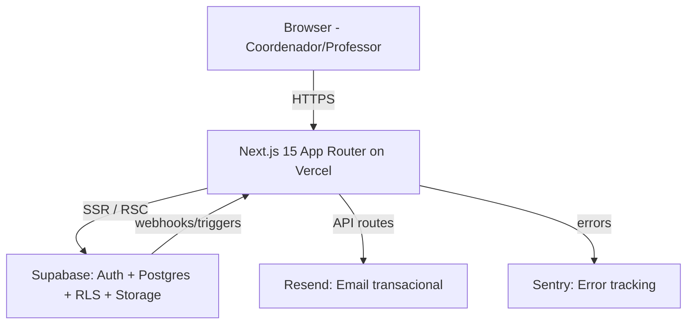
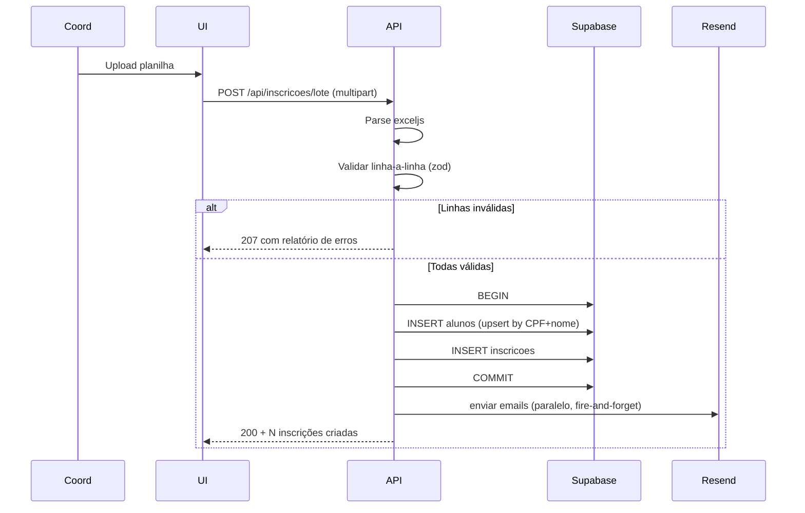

# SPEC: Sistema de Gestão de Olimpíadas do Conhecimento

**Refs:** [olimpiadas-prd.md](./olimpiadas-prd.md)
**ADRs:** ADR-0001 (Stack), ADR-0002 (Multitenancy + RLS), ADR-0003 (Storage), ADR-0004 (Export/Import), ADR-0005 (Auth/RBAC)
**Versão:** 1.0
**Data:** 2026-05-19

---

## 1. Objetivo

Construir aplicação web multi-tenant para gestão completa do ciclo de vida de olimpíadas do conhecimento na rede Raiz Educação (6 marcas, ~50 unidades, ~10k alunos). Cobre catálogo, calendário, inscrições, resultados, dashboard, com 4 perfis de acesso e isolamento de dados por marca via RLS PostgreSQL.

---

## 2. Arquitetura

### 2.1 Stack (validado contra `ag-referencia-stack-decisions`)

| Camada          | Tecnologia                                                | Justificativa                                            |
| --------------- | --------------------------------------------------------- | -------------------------------------------------------- |
| Frontend        | Next.js 15 (App Router) + React 19                        | Canonical Vercel; Server Components reduzem JS no client |
| UI              | Tailwind CSS + shadcn/ui                                  | Canonical do design system Raiz                          |
| State           | Server Components + React Query (TanStack) para mutations | Server-first; React Query só onde precisa cache cliente  |
| Forms           | react-hook-form + zod                                     | Canonical para validação                                 |
| Tabelas         | @tanstack/react-table v8                                  | Canonical para tabelas com filtros                       |
| Charts          | Recharts                                                  | Canonical para dashboards                                |
| Auth            | Supabase Auth (email/senha)                               | Canonical                                                |
| Database        | Supabase PostgreSQL + RLS                                 | Canonical para multitenancy                              |
| ORM/Query       | @supabase/supabase-js + SQL puro nas migrations           | Sem Prisma (rule stack)                                  |
| Storage         | Supabase Storage                                          | Para PDFs (regulamentos, certificados)                   |
| Email           | Resend + React Email                                      | Canonical para email transacional                        |
| PDF gen         | @react-pdf/renderer (server)                              | Streaming, sem Chromium                                  |
| Excel gen/parse | exceljs                                                   | Robusto para read+write                                  |
| ICS gen         | ics (npm)                                                 | Lightweight, RFC5545                                     |
| Deploy          | Vercel                                                    | Canonical                                                |
| Monitoring      | Sentry                                                    | Canonical                                                |
| Testing         | Vitest (unit) + Playwright (E2E)                          | Canonical                                                |

### 2.2 Diagrama macro



### 2.3 Estrutura de pastas

```
app/
  (auth)/
    login/page.tsx
    aceitar-convite/[token]/page.tsx
  (admin-rede)/
    dashboard/page.tsx
    marcas/page.tsx
    usuarios/page.tsx
  (marca)/
    dashboard/page.tsx
    olimpiadas/
      page.tsx                       # lista
      novo/page.tsx
      [id]/
        page.tsx                     # detalhe
        editar/page.tsx
        inscricoes/page.tsx
        resultados/page.tsx
    unidades/page.tsx
    calendario/page.tsx
  (unidade)/
    dashboard/page.tsx
    inscricoes/
      page.tsx
      nova/page.tsx
      lote/page.tsx                  # upload planilha
    resultados/page.tsx
    turmas/page.tsx
  (professor)/
    calendario/page.tsx
    inscricoes-turma/page.tsx
  api/
    inscricoes/lote/route.ts         # POST upload .xlsx
    inscricoes/planilha-modelo/route.ts  # GET .xlsx personalizado
    calendario/export-ics/route.ts
    calendario/export-pdf/route.ts
    dashboard/export/route.ts
    convites/aceitar/route.ts
    resend/inscricao-confirmada/route.ts

components/
  ui/                          # shadcn primitives
  olimpiadas/
  calendario/
  inscricoes/
  resultados/
  dashboard/
  layouts/

lib/
  supabase/
    server.ts                  # createServerClient (RSC)
    client.ts                  # createBrowserClient
    middleware.ts              # session refresh
  rls/
    policies.sql               # documentação policies
  email/
    templates/                 # React Email templates
    send.ts
  exports/
    pdf.tsx                    # @react-pdf/renderer components
    excel.ts                   # exceljs helpers
    ics.ts                     # ics generator
  validations/                 # zod schemas
  auth/
    rbac.ts                    # role → permissions matrix

supabase/
  migrations/
    20260519_001_schema_inicial.sql
    20260519_002_rls_policies.sql
    20260519_003_seed.sql
  seed.sql

tests/
  unit/
  e2e/

docs/
  specs/
  adr/
  plan/
  user-guide/                  # por perfil
```

---

## 3. Modelo de dados (PostgreSQL + RLS)

### 3.1 ERD textual

```
marca (1) ──< unidade (N)
unidade (1) ──< turma (N)
turma (1) ──< aluno (N)

olimpiada (1) ──< olimpiada_marca (N) >── marca (1)
olimpiada (1) ──< olimpiada_fase (N)
olimpiada (1) ──< inscricao (N)
inscricao (1) ──< resultado (N)  # 1 resultado por fase
aluno (1) ──< inscricao (N)

auth.users (1:1) usuario (perfil estendido)
usuario (N) ──< usuario_marca (N) >── marca  # multi-marca para coordenadores
usuario (N) ──< usuario_unidade (N) >── unidade
usuario (N) ──< usuario_turma (N) >── turma  # professor → turmas
```

### 3.2 Schema (resumo das tabelas principais)

```sql
-- ENUMS
CREATE TYPE classificacao_olimpiada AS ENUM ('obrigatoria', 'facultativa');
CREATE TYPE status_inscricao AS ENUM ('pendente', 'confirmada', 'cancelada');
CREATE TYPE tipo_resultado AS ENUM ('aprovado', 'nao_aprovado', 'ouro', 'prata', 'bronze', 'mencao_honrosa');
CREATE TYPE role_usuario AS ENUM ('admin_rede', 'coord_marca', 'coord_unidade', 'professor');
CREATE TYPE tipo_fase AS ENUM ('inscricao', 'prova_1', 'prova_2', 'final', 'divulgacao');

-- TENANCY
CREATE TABLE marca (
  id uuid PRIMARY KEY DEFAULT gen_random_uuid(),
  nome text NOT NULL UNIQUE,
  slug text NOT NULL UNIQUE,
  cor_primaria text,
  logo_url text,
  ativo boolean NOT NULL DEFAULT true,
  created_at timestamptz NOT NULL DEFAULT now()
);

CREATE TABLE unidade (
  id uuid PRIMARY KEY DEFAULT gen_random_uuid(),
  marca_id uuid NOT NULL REFERENCES marca(id) ON DELETE RESTRICT,
  nome text NOT NULL,
  cidade text,
  estado text,
  ativo boolean NOT NULL DEFAULT true,
  created_at timestamptz NOT NULL DEFAULT now(),
  UNIQUE (marca_id, nome)
);

CREATE TABLE turma (
  id uuid PRIMARY KEY DEFAULT gen_random_uuid(),
  unidade_id uuid NOT NULL REFERENCES unidade(id) ON DELETE RESTRICT,
  nome text NOT NULL,
  serie text NOT NULL,           -- ex: '5º ano', '9º ano', '2º EM'
  ano_letivo int NOT NULL,
  ativo boolean NOT NULL DEFAULT true,
  UNIQUE (unidade_id, nome, ano_letivo)
);

CREATE TABLE aluno (
  id uuid PRIMARY KEY DEFAULT gen_random_uuid(),
  turma_id uuid NOT NULL REFERENCES turma(id) ON DELETE RESTRICT,
  nome text NOT NULL,
  data_nascimento date NOT NULL,
  cpf text,                       -- nullable, mascarado em logs
  email_responsavel text,
  telefone_responsavel text,
  ativo boolean NOT NULL DEFAULT true,
  created_at timestamptz NOT NULL DEFAULT now(),
  UNIQUE (turma_id, nome, data_nascimento)
);
CREATE INDEX idx_aluno_turma ON aluno (turma_id);
CREATE INDEX idx_aluno_cpf ON aluno (cpf) WHERE cpf IS NOT NULL;

-- USUÁRIOS / RBAC
CREATE TABLE usuario (
  id uuid PRIMARY KEY REFERENCES auth.users(id) ON DELETE CASCADE,
  nome text NOT NULL,
  email text NOT NULL UNIQUE,
  role role_usuario NOT NULL,
  ativo boolean NOT NULL DEFAULT true,
  created_at timestamptz NOT NULL DEFAULT now()
);

CREATE TABLE usuario_marca (
  usuario_id uuid REFERENCES usuario(id) ON DELETE CASCADE,
  marca_id uuid REFERENCES marca(id) ON DELETE CASCADE,
  PRIMARY KEY (usuario_id, marca_id)
);

CREATE TABLE usuario_unidade (
  usuario_id uuid REFERENCES usuario(id) ON DELETE CASCADE,
  unidade_id uuid REFERENCES unidade(id) ON DELETE CASCADE,
  PRIMARY KEY (usuario_id, unidade_id)
);

CREATE TABLE usuario_turma (
  usuario_id uuid REFERENCES usuario(id) ON DELETE CASCADE,
  turma_id uuid REFERENCES turma(id) ON DELETE CASCADE,
  PRIMARY KEY (usuario_id, turma_id)
);

-- OLIMPÍADAS
CREATE TABLE olimpiada (
  id uuid PRIMARY KEY DEFAULT gen_random_uuid(),
  nome text NOT NULL,
  area_conhecimento text NOT NULL,          -- ex: 'Matemática', 'Português', 'Física'
  classificacao classificacao_olimpiada NOT NULL,
  organizacao_promotora text,
  descricao_html text,                      -- rich text (sanitized)
  caracteristicas_html text,
  regulamento_url text,                     -- supabase storage
  regulamento_link_externo text,
  premiacao text,
  series_elegiveis text[],                  -- ex: ['5º ano', '6º ano', '7º ano']
  faixa_etaria_min int,
  faixa_etaria_max int,
  ano_letivo int NOT NULL,
  limite_vagas_total int,                   -- opcional
  ativo boolean NOT NULL DEFAULT true,
  created_at timestamptz NOT NULL DEFAULT now(),
  created_by uuid REFERENCES usuario(id),
  updated_at timestamptz NOT NULL DEFAULT now()
);
CREATE INDEX idx_olimpiada_ano ON olimpiada (ano_letivo);
CREATE INDEX idx_olimpiada_area ON olimpiada (area_conhecimento);

CREATE TABLE olimpiada_marca (
  olimpiada_id uuid REFERENCES olimpiada(id) ON DELETE CASCADE,
  marca_id uuid REFERENCES marca(id) ON DELETE CASCADE,
  PRIMARY KEY (olimpiada_id, marca_id)
);

CREATE TABLE olimpiada_fase (
  id uuid PRIMARY KEY DEFAULT gen_random_uuid(),
  olimpiada_id uuid NOT NULL REFERENCES olimpiada(id) ON DELETE CASCADE,
  tipo tipo_fase NOT NULL,
  nome text NOT NULL,
  data_inicio date NOT NULL,
  data_fim date NOT NULL,
  ordem int NOT NULL,
  observacoes text,
  CONSTRAINT data_coerente CHECK (data_fim >= data_inicio)
);
CREATE INDEX idx_fase_olimpiada ON olimpiada_fase (olimpiada_id);
CREATE INDEX idx_fase_datas ON olimpiada_fase (data_inicio, data_fim);

-- INSCRIÇÕES
CREATE TABLE inscricao (
  id uuid PRIMARY KEY DEFAULT gen_random_uuid(),
  olimpiada_id uuid NOT NULL REFERENCES olimpiada(id) ON DELETE RESTRICT,
  aluno_id uuid NOT NULL REFERENCES aluno(id) ON DELETE RESTRICT,
  status status_inscricao NOT NULL DEFAULT 'pendente',
  inscrito_em timestamptz NOT NULL DEFAULT now(),
  inscrito_por uuid REFERENCES usuario(id),
  observacoes text,
  cancelado_em timestamptz,
  cancelado_motivo text,
  UNIQUE (olimpiada_id, aluno_id)
);
CREATE INDEX idx_inscricao_olimpiada ON inscricao (olimpiada_id);
CREATE INDEX idx_inscricao_aluno ON inscricao (aluno_id);
CREATE INDEX idx_inscricao_status ON inscricao (status);

-- RESULTADOS
CREATE TABLE resultado (
  id uuid PRIMARY KEY DEFAULT gen_random_uuid(),
  inscricao_id uuid NOT NULL REFERENCES inscricao(id) ON DELETE CASCADE,
  fase_id uuid NOT NULL REFERENCES olimpiada_fase(id) ON DELETE RESTRICT,
  tipo tipo_resultado NOT NULL,
  pontuacao numeric(10,2),
  observacoes text,
  comprovante_url text,                  -- supabase storage
  registrado_em timestamptz NOT NULL DEFAULT now(),
  registrado_por uuid REFERENCES usuario(id),
  UNIQUE (inscricao_id, fase_id)
);
CREATE INDEX idx_resultado_inscricao ON resultado (inscricao_id);
CREATE INDEX idx_resultado_fase ON resultado (fase_id);

-- AUDIT
CREATE TABLE audit_log (
  id bigserial PRIMARY KEY,
  usuario_id uuid REFERENCES usuario(id),
  entidade text NOT NULL,                -- ex: 'olimpiada', 'inscricao'
  entidade_id uuid NOT NULL,
  acao text NOT NULL,                    -- create | update | delete
  dados_antes jsonb,
  dados_depois jsonb,
  ip text,
  user_agent text,
  ocorreu_em timestamptz NOT NULL DEFAULT now()
);
CREATE INDEX idx_audit_entidade ON audit_log (entidade, entidade_id);
CREATE INDEX idx_audit_usuario ON audit_log (usuario_id, ocorreu_em DESC);

-- VIEWS PARA DASHBOARD (materialized para performance)
CREATE MATERIALIZED VIEW mv_dashboard_inscricoes AS
SELECT
  i.id AS inscricao_id,
  o.id AS olimpiada_id, o.nome AS olimpiada_nome, o.area_conhecimento, o.classificacao,
  m.id AS marca_id, m.nome AS marca_nome,
  u.id AS unidade_id, u.nome AS unidade_nome,
  t.id AS turma_id, t.serie,
  a.id AS aluno_id, a.nome AS aluno_nome,
  i.status, i.inscrito_em,
  o.ano_letivo
FROM inscricao i
JOIN aluno a ON a.id = i.aluno_id
JOIN turma t ON t.id = a.turma_id
JOIN unidade u ON u.id = t.unidade_id
JOIN marca m ON m.id = u.marca_id
JOIN olimpiada o ON o.id = i.olimpiada_id;

CREATE UNIQUE INDEX idx_mv_dash_inscricao ON mv_dashboard_inscricoes (inscricao_id);
CREATE INDEX idx_mv_dash_marca ON mv_dashboard_inscricoes (marca_id);
CREATE INDEX idx_mv_dash_unidade ON mv_dashboard_inscricoes (unidade_id);
```

### 3.3 RLS Policies (resumo — detalhes em ADR-0002)

**Princípio:** toda tabela com dados tenant-scoped tem RLS habilitado. Funções helper resolvem permissões por role.

```sql
-- Helper: obtém marcas acessíveis pelo usuário atual
CREATE OR REPLACE FUNCTION user_marca_ids() RETURNS uuid[]
LANGUAGE sql STABLE SECURITY DEFINER AS $$
  SELECT CASE
    WHEN (SELECT role FROM usuario WHERE id = auth.uid()) = 'admin_rede'
      THEN ARRAY(SELECT id FROM marca)
    WHEN (SELECT role FROM usuario WHERE id = auth.uid()) = 'coord_marca'
      THEN ARRAY(SELECT marca_id FROM usuario_marca WHERE usuario_id = auth.uid())
    WHEN (SELECT role FROM usuario WHERE id = auth.uid()) = 'coord_unidade'
      THEN ARRAY(
        SELECT DISTINCT u.marca_id FROM usuario_unidade uu
        JOIN unidade u ON u.id = uu.unidade_id
        WHERE uu.usuario_id = auth.uid()
      )
    WHEN (SELECT role FROM usuario WHERE id = auth.uid()) = 'professor'
      THEN ARRAY(
        SELECT DISTINCT u.marca_id FROM usuario_turma ut
        JOIN turma t ON t.id = ut.turma_id
        JOIN unidade u ON u.id = t.unidade_id
        WHERE ut.usuario_id = auth.uid()
      )
    ELSE ARRAY[]::uuid[]
  END
$$;

-- Exemplo de policy em olimpiada (visibilidade)
ALTER TABLE olimpiada ENABLE ROW LEVEL SECURITY;
CREATE POLICY olimpiada_select ON olimpiada FOR SELECT USING (
  EXISTS (
    SELECT 1 FROM olimpiada_marca om
    WHERE om.olimpiada_id = olimpiada.id
      AND om.marca_id = ANY (user_marca_ids())
  )
);

-- Write: admin_rede e coord_marca (apenas marcas próprias)
CREATE POLICY olimpiada_insert ON olimpiada FOR INSERT WITH CHECK (
  (SELECT role FROM usuario WHERE id = auth.uid()) IN ('admin_rede', 'coord_marca')
);
```

Policies análogas para `unidade`, `turma`, `aluno`, `inscricao`, `resultado`. Detalhe completo em ADR-0002 + arquivo `supabase/migrations/20260519_002_rls_policies.sql`.

---

## 4. Interfaces (API + Schemas)

### 4.1 Server Actions (Next.js)

Operações principais via Server Actions (não REST). Validação com zod.

```typescript
// lib/validations/olimpiada.ts
import { z } from "zod";

export const OlimpiadaInputSchema = z.object({
  nome: z.string().min(3).max(200),
  area_conhecimento: z.string().min(2),
  classificacao: z.enum(["obrigatoria", "facultativa"]),
  marca_ids: z.array(z.string().uuid()).min(1),
  series_elegiveis: z.array(z.string()),
  faixa_etaria_min: z.number().int().min(5).max(30).nullable(),
  faixa_etaria_max: z.number().int().min(5).max(30).nullable(),
  organizacao_promotora: z.string().optional(),
  descricao_html: z.string().optional(),
  caracteristicas_html: z.string().optional(),
  premiacao: z.string().optional(),
  ano_letivo: z.number().int().min(2026).max(2100),
  limite_vagas_total: z.number().int().positive().nullable(),
  fases: z
    .array(
      z.object({
        tipo: z.enum(["inscricao", "prova_1", "prova_2", "final", "divulgacao"]),
        nome: z.string(),
        data_inicio: z.string(), // ISO
        data_fim: z.string(),
        ordem: z.number().int(),
      }),
    )
    .min(1),
});
```

### 4.2 API Routes (apenas onde necessita HTTP)

| Method | Path                              | Auth                           | Descrição                                                 |
| ------ | --------------------------------- | ------------------------------ | --------------------------------------------------------- |
| POST   | `/api/inscricoes/lote`            | role IN (coord\_\*, professor) | Upload .xlsx, valida, importa em transação                |
| GET    | `/api/inscricoes/planilha-modelo` | role IN (coord\_\*, professor) | Gera .xlsx template com unidade/olimpíada pré-preenchidos |
| GET    | `/api/calendario/export-ics`      | qualquer autenticado           | Stream .ics filtrado por query params                     |
| GET    | `/api/calendario/export-pdf`      | qualquer autenticado           | Stream PDF                                                |
| GET    | `/api/dashboard/export`           | role hierarquia                | Excel ou PDF do dashboard                                 |
| POST   | `/api/convites/aceitar`           | público (token)                | Aceita convite, cria conta                                |

### 4.3 Tipos compartilhados

```typescript
// lib/types/index.ts
export type Role = "admin_rede" | "coord_marca" | "coord_unidade" | "professor";
export type StatusInscricao = "pendente" | "confirmada" | "cancelada";
export type TipoResultado =
  | "aprovado"
  | "nao_aprovado"
  | "ouro"
  | "prata"
  | "bronze"
  | "mencao_honrosa";

export interface Olimpiada {
  id: string;
  nome: string;
  area_conhecimento: string;
  classificacao: "obrigatoria" | "facultativa";
  marcas: Pick<Marca, "id" | "nome" | "slug">[];
  series_elegiveis: string[];
  ano_letivo: number;
  fases: OlimpiadaFase[];
  // ...
}
```

---

## 5. Fluxos críticos

### 5.1 Inscrição em lote (upload .xlsx)



### 5.2 Mudança de status com notificação

Trigger PostgreSQL `AFTER UPDATE OF status ON inscricao` chama webhook (`pg_net`) que dispara email via Resend. Alternativa: Server Action chama `resend.send()` direto após `update`.

### 5.3 Dashboard hierárquico

Materialized view `mv_dashboard_inscricoes` é refresh diário (cron) + on-demand via Server Action. Queries agregadas usam `GROUP BY marca_id / unidade_id / area_conhecimento`.

---

## 6. Edge cases

| #   | Caso                                                                | Tratamento                                                                            |
| --- | ------------------------------------------------------------------- | ------------------------------------------------------------------------------------- |
| 1   | Coordenador inscreve aluno em olimpíada não aplicável à marca       | Validação Zod + RLS (olimpiada_marca não tem linha) → erro                            |
| 2   | Upload planilha com encoding errado (Latin-1)                       | exceljs detecta + retorna erro com sugestão UTF-8                                     |
| 3   | Aluno duplicado na importação (mesmo CPF)                           | upsert por `(cpf)` se presente, senão `(turma_id, nome, data_nascimento)`             |
| 4   | Olimpíada com limite_vagas atingido                                 | INSERT inscricao falha com check (trigger BEFORE INSERT)                              |
| 5   | Data de prova alterada após inscrições                              | permitido por admin/coord_marca; trigger envia email a todos os inscritos             |
| 6   | Resultado registrado para aluno cuja inscrição foi cancelada        | bloqueado por trigger                                                                 |
| 7   | Coord de Marca tenta editar olimpíada de outra marca                | RLS UPDATE policy bloqueia (WITH CHECK)                                               |
| 8   | Professor tenta inscrever aluno de turma que não é dele             | RLS via usuario_turma + check de aluno.turma_id                                       |
| 9   | CPF inválido na importação                                          | zod schema valida formato; row marcada como erro                                      |
| 10  | Email do responsável vazio                                          | inscrição permitida, mas alerta no UI; sem envio Resend                               |
| 11  | Olimpíada futura (ano > atual) aparece no calendário sem inscrições | filtro por `ano_letivo` no dashboard                                                  |
| 12  | Marca arquivada (ativo=false)                                       | olimpíadas associadas continuam visíveis para histórico, mas ocultas em listas ativas |
| 13  | Aluno mudou de turma no meio do ano                                 | nova inscrição usa nova turma; histórico mantém turma anterior                        |
| 14  | LGPD: solicitação de exclusão de aluno                              | soft delete (ativo=false) + anonimização de PII após 5 anos (cron)                    |
| 15  | Token de convite expirado                                           | API valida `expires_at`, retorna 410 Gone                                             |

---

## 7. Critérios de aceite

### 7.1 Funcionais

- [ ] Admin Rede cadastra olimpíada multi-marca com todos os campos do PRD §3.1
- [ ] Calendário renderiza olimpíadas em visão mensal/anual/lista
- [ ] Filtros (marca, área, tipo) funcionam combinadamente
- [ ] Alerta de prazo ≤15 dias aparece no dashboard e dispara email
- [ ] Export .ics importa corretamente no Google Calendar e Outlook
- [ ] Export PDF do calendário fica legível em A4
- [ ] Planilha modelo é gerada com unidade/olimpíada pré-preenchidos
- [ ] Upload de planilha com 100 alunos importa em <30s
- [ ] Upload com erros retorna relatório linha-a-linha
- [ ] Inscrição individual dispara email Resend ao responsável
- [ ] Mudança de status (Pendente→Confirmada) dispara email
- [ ] Limite de vagas é respeitado (601ª inscrição em olimpíada de 600 vagas falha)
- [ ] Resultado pode ser registrado com upload de comprovante (PDF/imagem ≤5MB)
- [ ] Histórico do aluno mostra todas as inscrições e resultados
- [ ] Dashboard renderiza 4 visões (Rede/Marca/Unidade/Turma) com indicadores do PRD §3.6
- [ ] Export PDF/Excel do dashboard funciona

### 7.2 Não-funcionais

- [ ] Admin Rede vê dados de todas as 6 marcas
- [ ] Coord de Marca A NÃO consegue ler/editar/deletar dados da Marca B (teste de penetração RLS)
- [ ] Coord de Unidade NÃO vê unidades irmãs da mesma marca em listas próprias
- [ ] Professor só inscreve alunos das suas turmas (usuario_turma)
- [ ] Página inicial < 2s LCP (Vercel + RSC)
- [ ] Dashboard carrega em < 3s com 30.000 inscrições no histórico
- [ ] Mobile (tablet 768px+) responsivo em todas as telas críticas
- [ ] Lighthouse a11y ≥ 90 nas páginas principais
- [ ] Erros sem dados PII (mascaramento em Sentry)
- [ ] Logs de auditoria registram CRUD em olimpiada/inscricao/resultado/usuario

### 7.3 Segurança/LGPD

- [ ] RLS habilitado em **todas** as tabelas com dados tenant-scoped (auditoria por `ag-verificar-seguranca`)
- [ ] Testes automatizados de RLS rodam em CI
- [ ] CPF/email/telefone do aluno e responsável mascarados em logs (`***`)
- [ ] Política de privacidade linkada no footer
- [ ] DPA assinado com Supabase, Vercel, Resend

---

## 8. Test plan

### 8.1 Unit (Vitest)

- Validações zod (olimpiada, inscricao, aluno, planilha)
- Parser de planilha (exceljs)
- RBAC matrix (lib/auth/rbac.ts)
- PDF/Excel/ICS generators (snapshot)

### 8.2 Integration (Vitest + Supabase local)

- Cada Server Action com RLS aplicado
- Testes de policies: usuário X (role Y, escopo Z) consegue/não-consegue ação A na entidade B

### 8.3 E2E (Playwright)

- Fluxo 1: Admin cadastra olimpíada multi-marca → aparece no calendário
- Fluxo 2: Coord Marca cria unidade + turma + alunos
- Fluxo 3: Professor inscreve alunos em lote via planilha
- Fluxo 4: Mudança de status dispara email (mock Resend)
- Fluxo 5: Resultado registrado aparece no dashboard
- Fluxo 6: Isolamento RLS (login como Coord Marca A não vê Marca B)
- Fluxo 7: Export .ics e .pdf funcionam

### 8.4 Performance

- k6 ou similar: 100 concurrent users no dashboard
- Query plan EXPLAIN nas queries do dashboard

---

## 9. Rollback

- **Banco**: cada migration tem `_down.sql` reverso. Backups Supabase point-in-time.
- **Deploy**: Vercel rollback para deploy anterior (`vercel rollback`).
- **Feature flags**: módulos sensíveis (lote, export) atrás de flags via env var.

---

## 10. Decisões pendentes (para o usuário)

1. **Lista oficial de marcas/unidades**: precisamos da lista real para seed inicial?
2. **CPF obrigatório?** PRD diz opcional; confirmar.
3. **Resend domínio verificado**: qual domínio? (ex: `noreply@olimpiadas.raizeducacao.com.br`)
4. **Aluno via TOTVS**: importar via Excel inicialmente OK?
5. **Comprovante de resultado**: tamanho máximo 5MB OK?
6. **Conta Supabase / Vercel**: já provisionadas ou criar?

---

## 11. Out-of-scope reforçado

Ver PRD §4. Reforço: **sem integração TOTVS no V1**, **sem mobile app**, **sem pagamentos**, **sem auto-geração de certificado**.
